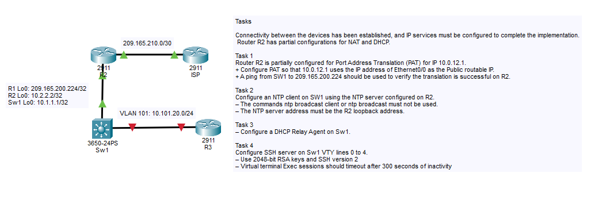
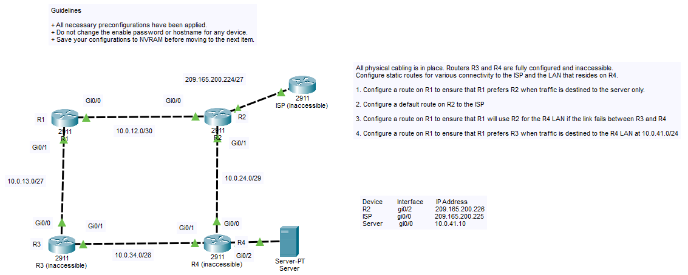
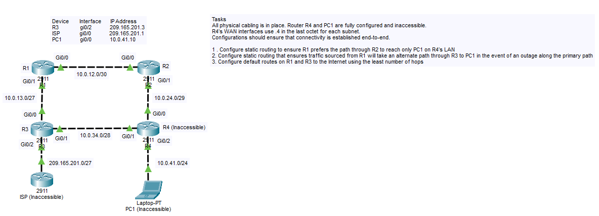
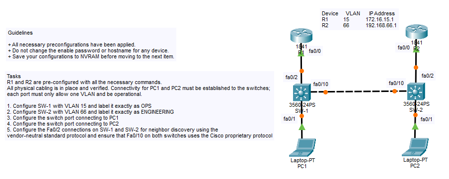
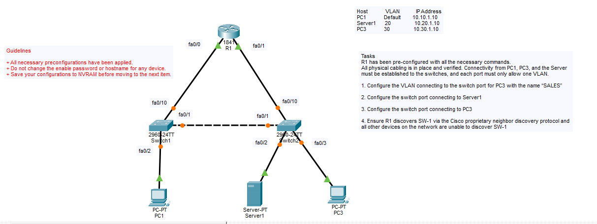
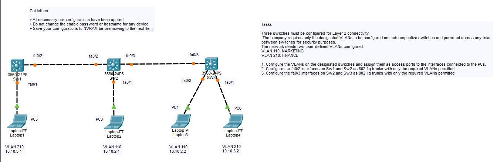

# Topologys
This repository contains my personal documentation and step-by-step explanations for the pre-configured labs provided by **Ironlink Computer Learning Center**. 

The goal of this project is to document my own approach to solving these technical challenges, focusing on the most efficient methods and providing clear reasoning for every configuration choice.

> [!IMPORTANT]  
> **Note on Access:** These Packet Tracer labs are exclusive to Ironlink alumni. While I cannot distribute the original lab files, my specific **device configurations and solution methodologies** are fully documented here for reference.

# NAT DHCP SSH Sim

# Named Access List DHCP Snooping Sim 3

# PAT NTP DHCP Relay

# Static Route Sim 1

# Static Route Sim 2

# Static Route Sim 3

# Static Route Sim 4

# VLAN CDP LLDP Sim

# VLAN CDP Sim

# VLAN CDP Sim 2

# VLAN LLDP Sim

# VLAN and Trunking Sim

