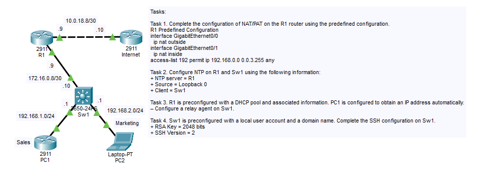
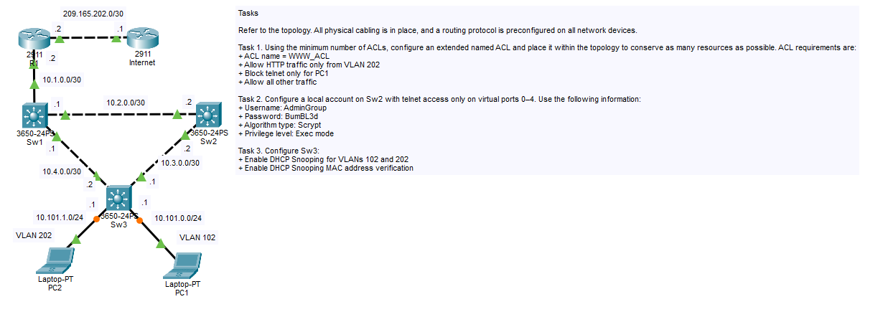
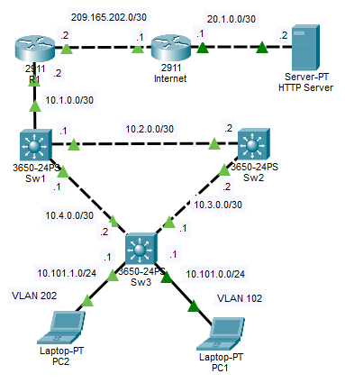
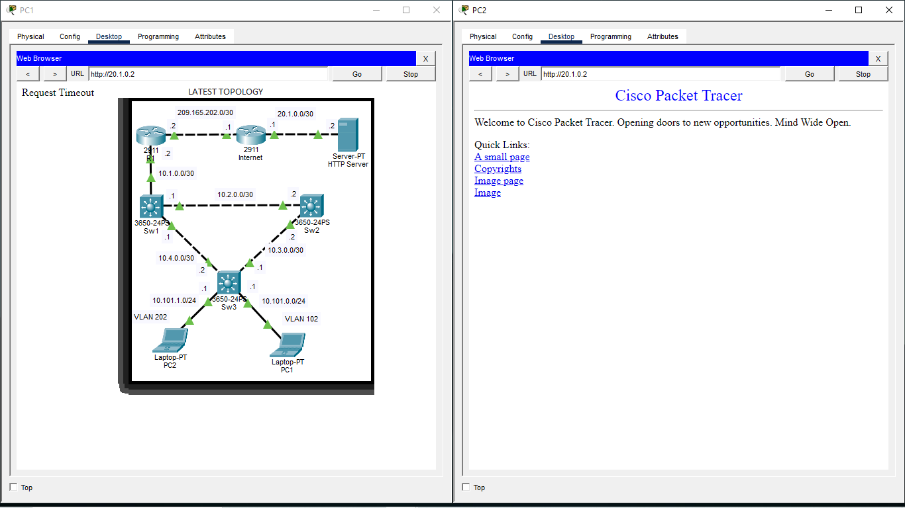
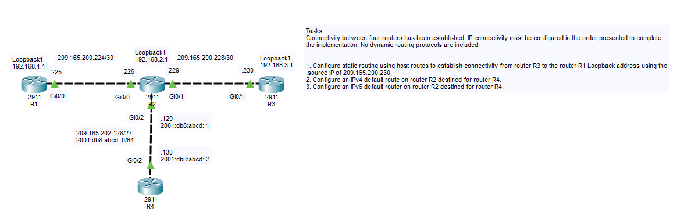
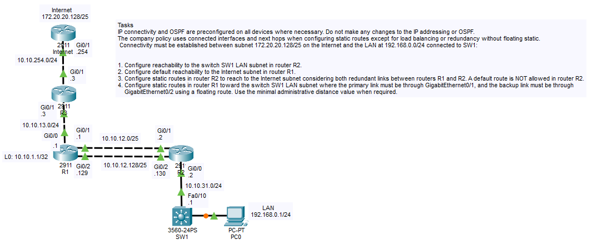
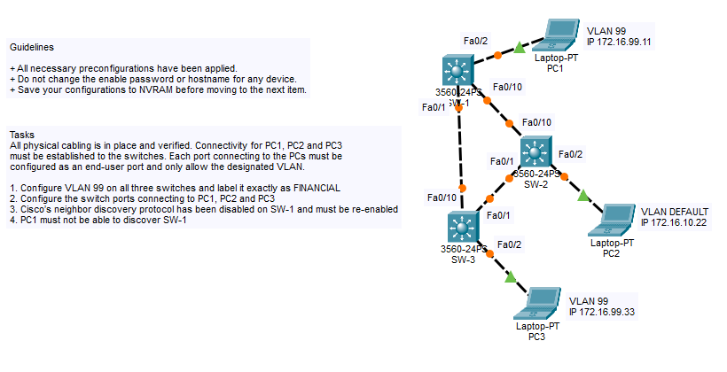
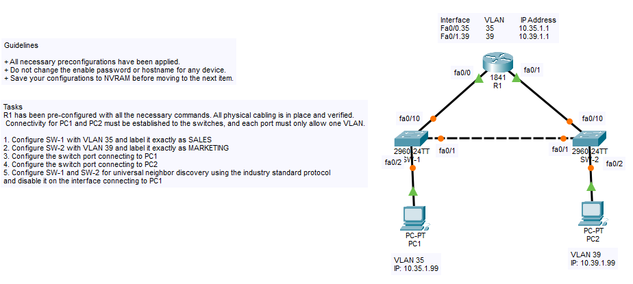
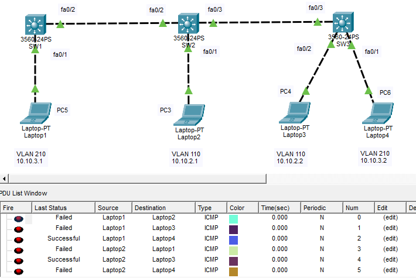

# Topologys
This repository contains my personal documentation and step-by-step explanations for the pre-configured labs provided by **Ironlink Computer Learning Center**. 

The goal of this project is to document my own approach to solving these technical challenges, focusing on the most efficient methods and providing clear reasoning for every configuration choice.

> [!IMPORTANT]  
> **Note on Access:** These Packet Tracer labs are exclusive to Ironlink alumni. While I cannot distribute the original lab files, my specific **device configurations and solution methodologies** are fully documented here for reference.

___
# NAT DHCP SSH Sim


___
# Named Access List DHCP Snooping Sim 3


<details>
<summary>Click to view configuration and explanation</summary>
  
### I added a server to act as an HTTP host so I could verify the ACL rules.


### Task 1: Configure R1
```
R1>en
R1#conf t
R1(config)#ip access-list extended WWW_ACL
R1(config-ext-nacl)#10 deny tcp host 10.101.1.2 any eq telnet
R1(config-ext-nacl)#20 permit tcp 10.101.1.0 0.0.0.255 any eq www
R1(config-ext-nacl)#25 deny tcp any any eq www
R1(config-ext-nacl)#30 permit ip any any
```
To meet the requirements, I configured the WWW_ACL using a top-down logical approach. I first placed a specific deny for PC1's Telnet traffic at the top to ensure it is dropped immediately, followed by an explicit permit for the VLAN 202 subnet to access HTTP (port 80). I then added a general deny for all other HTTP traffic to strictly enforce that "only" VLAN 202 can use that port, and finally, I included a permit ip any any statement to act as a catch-all, ensuring all other non-restricted traffic—like Pings and DNS—is allowed to pass for the rest of the network.


### Task 2: Configure SW2
```
SW2>en
SW2#conf t
SW2(config)#username AdminGroup privilege 1 algorithm-type scrypt secret BumBL3d
SW2(config)#line vty 0 4
SW2(config)#login local
SW2(config)#transport input telnet
```
On SW2, I created a local user named AdminGroup with Privilege Level 1 to provide standard Exec mode access, using the Scrypt algorithm (Type 9) to securely hash the password BumBL3d. I then applied this to virtual ports 0–4 by enabling local authentication and restricting the lines to Telnet access only via the ```transport input telnet``` command. This ensures that only the local database is used for logins and that more secure or alternative protocols like SSH are explicitly disabled on these ports.

### Task 3: Configure SW3
```
SW3>en
SW3#conf t
SW3(config)#ip dhcp snooping vlan 102,202
SW3(config)#ip dhcp snooping verify mac-address
```
To enhance Layer 2 security on SW3, I enabled DHCP Snooping for VLANs 102 and 202 and activated MAC address verification to ensure the source MAC address in DHCP requests matches the client's hardware address. This configuration builds a DHCP binding database that prevents DHCP spoofing attacks by ensuring users only receive IP addresses from legitimate sources while dropping packets from unauthorized or rogue DHCP servers.

<!-- add images or gif nung traffic flow ng topology -->
</details>

___
# PAT NTP DHCP Relay


___
# Static Route Sim 1


___
# Static Route Sim 2


___
# Static Route Sim 3


___
# Static Route Sim 4


___
# VLAN CDP LLDP Sim


___
# VLAN CDP Sim


___
# VLAN CDP Sim 2


___
# VLAN LLDP Sim


<details>
<summary>Click to view configuration and explanation</summary>

### 1. Configure SW-1 with VLAN 35 and label it exactly as SALES
```
SW1>en
SW1#conf t
SW1(config)#vlan 35
SW1(config-vlan)#name SALES
SW1(config-vlan)#exit
```
To create VLANs, enter the command `SW1(config)#vlan [vlan-id]`. To name the vlan, enter `SW1(config-vlan)#name [NAME]` while in VLAN configuration mode

### 2. Configure SW-2 with VLAN 39 and label it exactly as MARKETING
```
SW2>en
SW2#conf t
SW2(config)#vlan 39
SW2(config-vlan)#name MARKETING
SW2(config-vlan)#exit
```
To create VLANs, enter the command `SW2(config)#vlan [vlan-id]`. To name the vlan, enter `SW2(config-vlan)#name [NAME]` while in VLAN configuration mode

### 3. Configure the switch port connecting to PC1
```
SW1>en
SW1#conf t
SW1(config)#int f0/2
SW1(config-if)#switch mode access
SW1(config-if)#switch access vlan 35
SW1(config-if)#exit
```
We are configuring interface f0/2 (connected to PC1) as an access port and assigning it to VLAN 35. To do this, while in interface configuration mode, `SW1(config-if)#enter switchport mode access` to statically set the port to access mode. Then, use the command `SW1(config-if)#switchport access vlan [vlan-id]` to assign the specific VLAN to that port.

### 4. Configure the switch port connecting to PC2
```
SW2>en
SW2#conf t
SW2(config)#int f0/2
SW2(config-if)#switch mode access
SW2(config-if)#switch access vlan 39
SW2(config-if)#exit
```
We are configuring interface f0/2 (connected to PC2) as an access port and assigning it to VLAN 39. To do this, while in interface configuration mode, `SW2(config-if)#enter switchport mode access` to statically set the port to access mode. Then, use the command `SW2(config-if)#switchport access vlan [vlan-id]` to assign the specific VLAN to that port.

### 5. Configure SW-1 and SW-2 for universal neighbor discovery using the industry standard protocol and disable it on the interface connecting to PC1
### Switch 1
```
SW1>en
SW1#conf t
SW1(config)#lldp run
SW1(config)#int f0/2
SW1(config-if)#no lldp transmit
SW1(config-if)#no lldp receive
SW1(config-if)#exit
```
To enable universal neighbor discovery using the industry-standard protocol (LLDP), enter the command `SW1(config)#lldp run`. We are then tasked to disable discovery on the interface connecting to PC1. To do this, enter interface configuration mode with `SW1(config)#interface f0/2` and use the commands `SW1(config-if)#no lldp transmit` and `SW1(config-if)#no lldp receive` to stop the switch from sending or receiving discovery packets on that interface

### Switch 2
```
SW2>en
SW2#conf t
SW2(config)#lldp run
SW2(config)#int f0/2
SW2(config-if)#exit
```
To enable universal neighbor discovery using the industry-standard protocol (LLDP), enter the command `SW2(config)#lldp run`.
</details>

___
# VLAN and Trunking Sim


<details>
<summary>Click to view configuration and explanation</summary>

### 1. Configure the VLANs on the designated switches and assign them as access ports to the interfaces connected to the PCs.

### Switch 1
```
SW1>en
SW1#conf t
SW1(config)#vlan 210
SW1(config-vlan)#name FINANCE
SW1(config-vlan)#int f0/1
SW1(config-if)#switchport mode access
SW1(config-if)#switchport access vlan 210
SW1(config-if)#exit
```
To create VLANs, enter the command `SW1(config)#vlan [vlan-id]`. To name the vlan, enter `SW1(config-vlan)#name [NAME]` while in VLAN configuration mode. After creating and labeling VLAN 210, assign it to the interface connected to the laptop by entering `SW1(config-if)#switchport mode access` and `SW1(config-if)#switchport access vlan 210`.

### Switch 2
```
SW2>en
SW2#conf t
SW2(config)#vlan 110
SW2(config-vlan)#name MARKETING
SW2(config-vlan)#vlan 210
SW2(config-vlan)#name FINANCE
SW2(config-vlan)#int f0/1
SW2(config-if)#switchport mode access
SW2(config-if)#switchport access vlan 110
SW2(config-if)#exit
```
To create VLANs, enter the command `SW2(config)#vlan [vlan-id]`. To name the VLAN, enter `SW2(config-vlan)#name [NAME]` while in VLAN configuration mode. For Switch 2, it is necessary to create VLAN 210 for trunking to function correctly. Even if the switch does not have end-user devices phsycally plugged into a specific VLAN, it cannot pass that traffic through its trunk ports if it doesn't know the VLANs exist. After configuring the VLANs, assign the appropriate VLAN to the interface connected to the laptop by entering `SW2(config-if)#switchport mode access` and `SW2(config-if)#switchport access vlan [vlan-id]`.

### Switch 3
```
SW3>en
SW3#conf t
SW3(config)#vlan 110
SW3(config-vlan)#name MARKETING
SW3(config-vlan)#vlan 210
SW3(config-vlan)#name FINANCE
SW3(config-vlan)#int f0/1
SW3(config-if)#switchport mode access
SW3(config-if)#switchport access vlan 210
SW3(config-if)#int f0/2
SW3(config-if)#switchport mode access
SW3(config-if)#switchport access vlan 110
SW3(config-if)#exit
```
To create VLANs, enter the command `SW3(config)#vlan [vlan-id]`. To name the vlan, enter `SW3(config-vlan)#name [NAME]` while in VLAN configuration mode. After creating and labeling VLANs, assign the appropriate VLAN to the interface connected to the laptop by entering `SW3(config-if)#switchport mode access` and `SW3(config-if)#switchport access vlan [vlan-id]`.


### 2. Configure the fa0/2 interfaces on Sw1 and Sw2 as 802.1q trunks with only the required VLANs permitted.

### Switch 1
```
SW1>en
SW1#conf t
SW1(config)#int f0/2
SW1(config-if)#switchport trunk encapsulation dot1q
SW1(config-if)#switchport mode trunk
SW1(config-if)#switchport trunk allowed vlan 210
SW1(config-if)#exit
```
To configure a port as a trunk, enter the command `SW1(config-if)#switchport mode trunk`. If the switch rejects the command, enter `SW1(config-if)#switchport trunk encapsulation dot1q` and then re-enter the previous command. The switch rejects the command because it is currently set to 'auto' encapsulation. Since it supports more than one trunking method, meaning it is capable of using either the industry-standard 'dot1q' or the older Cisco-proprietary 'ISL'. You must manually lock it to 'dot1q' before it is allowed to become a trunk. Essentially, the switch is waiting for you to tell it which 'language' to speak before it activates the link. After that, allow VLAN 210 to pass through the trunk port by entering `SW1(config-if)#switchport allowed vlan 210`.

### Switch 2
```
SW2>en
SW2#conf t
SW2(config)#int f0/2
SW2(config-if)#switchport trunk encapsulation dot1q
SW2(config-if)#switchport mode trunk
SW2(config-if)#switchport trunk allowed vlan 210
SW2(config-if)#exit
```

### 3. Configure the fa0/3 interfaces on Sw2 and Sw3 as 802.1q trunks with only the required VLANs permitted.

### Switch 2
```
SW2>en
SW2#conf t
SW2(config)#int f0/3
SW2(config-if)#switchport trunk encapsulation dot1q
SW2(config-if)#switchport mode trunk
SW2(config-if)#switchport trunk allowed vlan 110,210
SW2(config-if)#exit
```

### Switch 3
```
SW3>en
SW3#conf t
SW3(config)#int f0/3
SW3(config-if)#switchport trunk encapsulation dot1q
SW3(config-if)#switchport mode trunk
SW3(config-if)#switchport trunk allowed vlan 110,210
SW3(config-if)#exit
```

<!-- lmao, just realized, linalagyan ko lahat masyado ng explanation yung mga steps na naexplain ko na sa previous steps and super reduntant masyado. gotta clean the mess latur... -->

### Result


I'm testing the laptops across the whole network. Laptops in the same VLAN should ping successfully, but packets should be dropped if the laptops are in different VLANs. In this lab, Laptop 1 should only be able to ping Laptop 4 vice versa, and Laptop 2 should only be able to ping Laptop 3 vice versa.
</details>