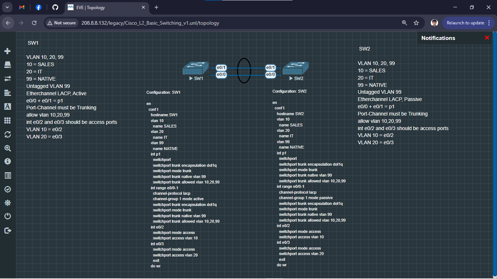
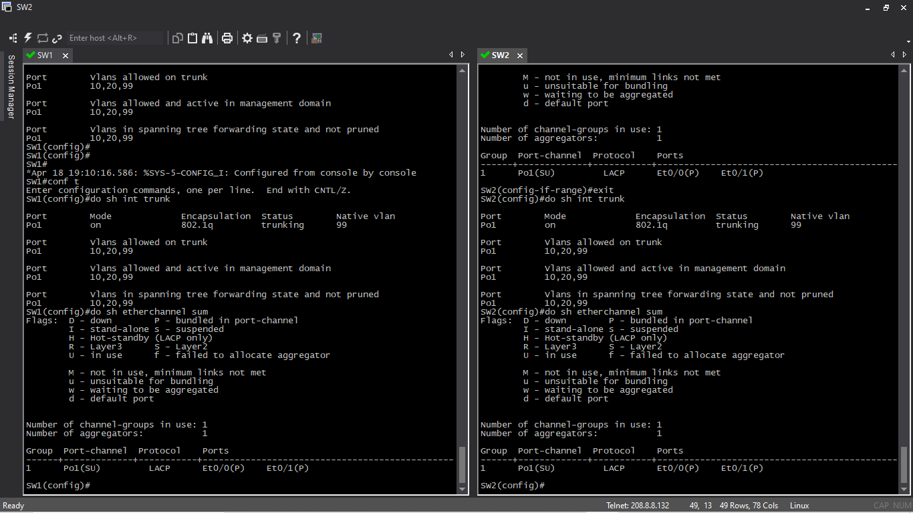

# Topology

___
## Fixed
A Native VLAN mismatch between Et0/0, Et0/1, and Po1 prevented the EtherChannel from bundling. I created the Port-channel first and manually configured the interface with trunk encapsulation and trunk mode before adding the physical interfaces to the channel-group. To avoid "bundle incompatible" errors, ensure that the physical interfaces match the allowed VLANs and Native VLAN of the Port-channel exactly.

___
## Needs fixing (Fixed)
Etherchannel not forming if interface Port1 is configured with Trunk (17.04.2026)

### Without Trunk

### Running Config

### With Trunk

___
> [!NOTE]
> This Documentation is for **[Cisco_L2_Basic_Switching_v1](../Cisco_L2_Basic_Switching_v1)**
